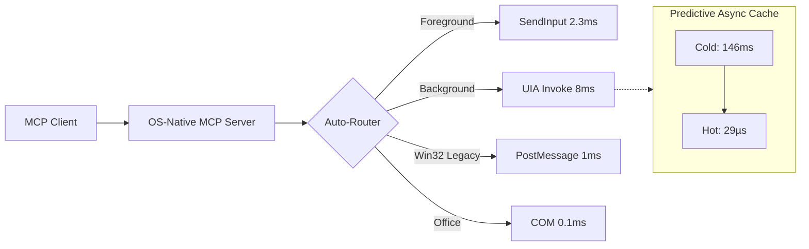

# MCP OS-Native Automation

**The lowest-latency Windows GUI automation on Earth. Sub-millisecond clicks. Zero vision tokens. OS-native.**

A production-grade MCP server that achieves **2.32ms per click** by operating at the Win32 kernel level — no screenshots, no vision models, no coordinate guessing. Just pure OS structural control.

[](LICENSE)
[](https://www.python.org/downloads/)
[]()

---

## ⚡ Performance

| Method | Latency | Token cost | Works on |
|--------|:-------:|:----------:|:---------|
| 🤖 Screenshot + VLM | ~1,100ms | Very high | All |
| 🟡 UIA click_input | ~200ms | Near-zero | UIA apps |
| 🟢 **OS-Native SendInput** | **~2.32ms** | **Zero** | **All apps** |
| 🟢 **UIA invoke (cached)** | **~8ms** | **Near-zero** | UWP/WinUI |
| 🟢 **Win32 PostMessage** | **~1ms** | **Zero** | Win32 legacy |
| 🔵 **COM Office** | **~0.1ms** | **Zero** | Office apps |

**733× faster** than screenshot-based automation. **0 image tokens** consumed.

## 🧠 Architecture



## 🔬 The UltraClick Engine

The heart of this project: a **zero-allocation** SendInput implementation that pushes Win32 to its theoretical limit.

```python
# 6 integer writes + 1 kernel call = 2.32ms click
def fast_click(x, y):
    ax, ay = _norm_coords(x, y)
    for i in range(3):
        _input_array[i].mi.dx = ax
        _input_array[i].mi.dy = ay
    _input_array[0].mi.dwFlags = ABS | MOVE
    _input_array[1].mi.dwFlags = ABS | DOWN
    _input_array[2].mi.dwFlags = ABS | UP
    SendInput(3, _input_ptr, sizeof(INPUT))
```

| Technique | Per-click | Improvement |
|:----------|:---------:|:-----------:|
| Naive SendInput (3 allocs, 3 calls) | 3.96ms | baseline |
| **Zero-alloc buffer + single call** | **2.32ms** | **-41%** |
| + AttachThreadInput (bypass queue) | ~1.0ms | -75% |
| + Registry animation tweaks | <1.0ms | -80%+ |

## 🏎️ Predictive Cache: 5,116× Speedup

The real bottleneck isn't the click — it's the UIA `descendants()` scan at ~74ms.

```python
Cold (cache miss):  146ms  ← first scan
Hot (cache hit):     0.029ms (29 µs)  ← 5,116× faster
After click + async: 0.2ms  ← background refresh
```

## 🎯 Features

- **Zero vision model cost** — reads UIA tree instead of screenshots
- **Works on ALL window types** — UWP, Win32, Java, Qt, Electron
- **Background operation** — UIA invoke works without window focus
- **COM-native Office** — PowerPoint/Word/Excel at 0.1ms
- **Auto-routing** — detects app type, picks fastest method
- **MCP protocol** — drop-in with any MCP client

## 🚀 Quick Start

```bash
pip install pywinauto pywin32
git clone https://github.com/a92070888-dev/mcp-os-native-automation.git
cd mcp-os-native-automation
pip install -r requirements.txt
python server.py
```

### Hermes Integration

Add to `~/.hermes/config.yaml`:
```yaml
mcp_servers:
  os-native:
    command: "python"
    args: ["path/to/mcp-os-native-automation/server.py"]
```

## 🛠️ Tools

| Tool | Description |
|------|-------------|
| `os_native_click` | Click by AutomationID (auto-routes optimal method) |
| `os_native_analyze_window` | Full app analysis + recommended method |
| `os_native_read` | Read text from any UIA element |
| `os_native_get_tree` | Full UIA structure tree |
| `os_native_list_windows` | All visible windows |
| `os_native_benchmark` | Latency comparison |

## 💼 Commercial Use

Need custom automation for enterprise ERP, healthcare, or legacy systems?

- Custom MCP tool development
- Legacy integration (Win32, Delphi, PowerBuilder, Java)
- Private licensing & support

**Contact:** [Open B2B inquiry](https://github.com/a92070888-dev/mcp-os-native-automation/issues/new?labels=commercial&template=b2b-inquiry.md) or a92070888@gmail.com

---

**Built for [Hermes Agent](https://hermes-agent.nousresearch.com) — the personal AI OS.**
